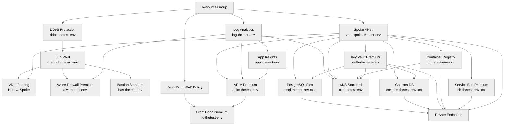

# Step 4: Implementation Plan - the-test

> Generated by bicep-plan agent | 2026-02-11

> [!NOTE]
> 📚 See [SKILL.md](../../.github/skills/azure-artifacts/SKILL.md) for visual standards.

## Overview

This implementation plan defines the Bicep Infrastructure as Code for **the-test** — a PCI-DSS Level 1 payment gateway on Azure processing 10,000 TPS sustained. The architecture follows a hub-spoke network topology with AKS as the compute platform, PostgreSQL Flexible Server for transactional data, Cosmos DB for session state, and comprehensive security controls for PCI-DSS v4.0 compliance.

**Key Design Principles**:

- **AVM-first**: 15 of 18 resources use Azure Verified Modules
- **Zero-trust**: Managed identity everywhere, private endpoints for all data services
- **PCI-DSS compliant**: Network segmentation, HSM-backed keys, 1-year log retention, IDPS
- **Hub-spoke**: Centralized firewall and bastion in hub; AKS, databases, APIM in spoke

**Governance**: 5 policy initiatives discovered (0 Deny, 3 DeployIfNotExists, 2 Audit). No deployment blockers. See [04-governance-constraints.md](04-governance-constraints.md).

---

## Resource Inventory

### 🌐 Networking Resources

| Resource | Type | SKU | AVM Module | Version | Dependencies |
| --- | --- | --- | --- | --- | --- |
| Hub Virtual Network | Microsoft.Network/virtualNetworks | — | ✅ `avm/res/network/virtual-network` | `0.7.2` | Resource Group |
| Spoke Virtual Network | Microsoft.Network/virtualNetworks | — | ✅ `avm/res/network/virtual-network` | `0.7.2` | Resource Group |
| Hub NSG (Firewall) | Microsoft.Network/networkSecurityGroups | — | ✅ `avm/res/network/network-security-group` | `0.5.2` | Resource Group |
| Spoke NSGs (×4) | Microsoft.Network/networkSecurityGroups | — | ✅ `avm/res/network/network-security-group` | `0.5.2` | Resource Group |
| Azure Firewall | Microsoft.Network/azureFirewalls | Premium | ✅ `avm/res/network/azure-firewall` | `0.9.2` | Hub VNet, Firewall Policy |
| Azure Bastion | Microsoft.Network/bastionHosts | Standard | ✅ `avm/res/network/bastion-host` | `0.8.2` | Hub VNet |
| DDoS Protection Plan | Microsoft.Network/ddosProtectionPlans | Standard | ✅ `avm/res/network/ddos-protection-plan` | `0.3.2` | Resource Group |
| VNet Peering (Hub↔Spoke) | Microsoft.Network/virtualNetworks/virtualNetworkPeerings | — | ⚠️ Inline (via VNet module) | — | Hub VNet, Spoke VNet |
| Azure Front Door Premium | Microsoft.Cdn/profiles | Premium | ✅ `avm/res/cdn/profile` | `0.17.1` | WAF Policy |
| Front Door WAF Policy | Microsoft.Network/frontDoorWebApplicationFirewallPolicies | Premium_AzureFrontDoor | ✅ `avm/res/network/front-door-web-application-firewall-policy` | `0.3.3` | Resource Group |

### 💻 Compute Resources

| Resource | Type | SKU | AVM Module | Version | Dependencies |
| --- | --- | --- | --- | --- | --- |
| AKS Cluster | Microsoft.ContainerService/managedClusters | Standard tier | ✅ `avm/res/container-service/managed-cluster` | `0.12.0` | Spoke VNet, Log Analytics, ACR, Key Vault |
| Container Registry | Microsoft.ContainerRegistry/registries | Premium | ✅ `avm/res/container-registry/registry` | `0.10.0` | Resource Group |

### 🔀 API Layer

| Resource | Type | SKU | AVM Module | Version | Dependencies |
| --- | --- | --- | --- | --- | --- |
| API Management | Microsoft.ApiManagement/service | Premium (1 unit) | ✅ `avm/res/api-management/service` | `0.14.0` | Spoke VNet, App Insights, Key Vault |

### 💾 Data Resources

| Resource | Type | SKU | AVM Module | Version | Dependencies |
| --- | --- | --- | --- | --- | --- |
| PostgreSQL Flexible Server | Microsoft.DBforPostgreSQL/flexibleServers | Memory Optimized E16s_v5 | ✅ `avm/res/db-for-postgre-sql/flexible-server` | `0.15.1` | Spoke VNet (private endpoint), Key Vault |
| Cosmos DB Account | Microsoft.DocumentDB/databaseAccounts | NoSQL, Autoscale 10K-50K RU/s | ✅ `avm/res/document-db/database-account` | `0.18.0` | Spoke VNet (private endpoint), Key Vault |

### 📨 Messaging Resources

| Resource | Type | SKU | AVM Module | Version | Dependencies |
| --- | --- | --- | --- | --- | --- |
| Service Bus Namespace | Microsoft.ServiceBus/namespaces | Premium (1 MU) | ✅ `avm/res/service-bus/namespace` | `0.16.1` | Spoke VNet (private endpoint) |

### 🔐 Security Resources

| Resource | Type | SKU | AVM Module | Version | Dependencies |
| --- | --- | --- | --- | --- | --- |
| Key Vault | Microsoft.KeyVault/vaults | Premium (HSM) | ✅ `avm/res/key-vault/vault` | `0.13.3` | Spoke VNet (private endpoint) |

### 📊 Monitoring Resources

| Resource | Type | SKU | AVM Module | Version | Dependencies |
| --- | --- | --- | --- | --- | --- |
| Log Analytics Workspace | Microsoft.OperationalInsights/workspaces | PerGB2018 | ✅ `avm/res/operational-insights/workspace` | `0.15.0` | Resource Group |
| Application Insights | Microsoft.Insights/components | — | ✅ `avm/res/insights/component` | `0.7.1` | Log Analytics Workspace |

### Summary

| Category | Count | AVM | Custom |
| --- | --- | --- | --- |
| Networking | 10 | 9 | 1 (VNet peering inline) |
| Compute | 2 | 2 | 0 |
| API Layer | 1 | 1 | 0 |
| Data | 2 | 2 | 0 |
| Messaging | 1 | 1 | 0 |
| Security | 1 | 1 | 0 |
| Monitoring | 2 | 2 | 0 |
| **Total** | **19** | **18** | **1** |

---

## Module Structure

```
infra/bicep/the-test/
├── main.bicep                          # Orchestration — all module calls
├── main.bicepparam                     # Parameter file (dev/prod overrides)
├── modules/
│   ├── networking/
│   │   ├── hub-network.bicep           # Hub VNet, Firewall subnet, Bastion subnet
│   │   ├── spoke-network.bicep         # Spoke VNet, AKS/DB/APIM subnets, NSGs
│   │   ├── vnet-peering.bicep          # Bidirectional hub↔spoke peering
│   │   ├── azure-firewall.bicep        # Azure Firewall Premium + policy
│   │   ├── bastion.bicep               # Azure Bastion Standard
│   │   ├── ddos-protection.bicep       # DDoS Network Protection plan
│   │   ├── front-door.bicep            # Azure Front Door Premium + WAF policy
│   │   └── private-endpoints.bicep     # Private endpoints for data services
│   ├── compute/
│   │   ├── aks-cluster.bicep           # AKS with system + CDE node pools
│   │   └── container-registry.bicep    # ACR Premium with geo-replication
│   ├── data/
│   │   ├── postgresql.bicep            # PostgreSQL Flex Server (zone-redundant HA)
│   │   └── cosmos-db.bicep             # Cosmos DB NoSQL (autoscale)
│   ├── security/
│   │   └── key-vault.bicep             # Key Vault Premium (HSM-backed)
│   ├── api/
│   │   └── api-management.bicep        # APIM Premium (VNet-integrated)
│   ├── messaging/
│   │   └── service-bus.bicep           # Service Bus Premium (1 MU)
│   └── monitoring/
│       ├── log-analytics.bicep         # Log Analytics (1-year retention)
│       └── app-insights.bicep          # Application Insights
└── deploy.ps1                          # Deployment script (lint, build, what-if, deploy)
```

---

## Implementation Tasks

### Task 1: main.bicep (Orchestration)

**Purpose**: Main entry point — defines parameters, variables, and orchestrates all module deployments in dependency order.

**Parameters**:

| Parameter | Type | Default | Description |
| --- | --- | --- | --- |
| `location` | string | `'swedencentral'` | Primary deployment region |
| `environment` | string | `'dev'` | Environment name (`dev`, `staging`, `prod`) |
| `projectName` | string | `'the-test'` | Project identifier |
| `owner` | string | — | Resource owner (Deny-enforced tag) |
| `costCenter` | string | — | Cost center code (Deny-enforced tag) |
| `technicalContact` | string | — | Technical contact email (Deny-enforced tag) |
| `sla` | string | `'99.99'` | SLA target (Deny-enforced tag) |
| `backupPolicy` | string | `'daily'` | Backup policy (Deny-enforced tag) |
| `maintWindow` | string | `'Sun:02:00-06:00'` | Maintenance window (Deny-enforced tag) |
| `aksSystemNodeCount` | int | `3` | System node pool count |
| `aksCdeNodeMinCount` | int | `3` | CDE node pool min (autoscale) |
| `aksCdeNodeMaxCount` | int | `20` | CDE node pool max (autoscale) |
| `cosmosDbMaxRu` | int | `50000` | Cosmos DB autoscale max RU/s |
| `postgresqlSkuName` | string | `'Standard_E16s_v5'` | PostgreSQL SKU |
| `postgresqlStorageSizeGB` | int | `512` | PostgreSQL storage size |

**Variables**:

```yaml
- uniqueSuffix: uniqueString(resourceGroup().id)  # Generated once, passed everywhere
- requiredRgTags:                    # ALL 9 REQUIRED by JV-Enforce RG Tags v3 (Deny)
    environment: environment         # lowercase, case-sensitive
    owner: owner
    costcenter: costCenter
    application: 'the-test'
    workload: 'payment-gateway'
    sla: sla
    backup-policy: backupPolicy
    maint-window: maintWindow
    technical-contact: technicalContact
- additionalTags:                    # Project convention (not policy-enforced)
    ManagedBy: 'Bicep'
    Project: 'the-test'
- tags: union(requiredRgTags, additionalTags)
- hubVnetName: vnet-hub-${projectName}-${environment}
- spokeVnetName: vnet-spoke-${projectName}-${environment}
```

**Modules Called** (in dependency order):

1. `modules/monitoring/log-analytics.bicep`
2. `modules/monitoring/app-insights.bicep`
3. `modules/networking/ddos-protection.bicep`
4. `modules/networking/hub-network.bicep`
5. `modules/networking/spoke-network.bicep`
6. `modules/networking/vnet-peering.bicep`
7. `modules/networking/azure-firewall.bicep`
8. `modules/networking/bastion.bicep`
9. `modules/security/key-vault.bicep`
10. `modules/data/postgresql.bicep`
11. `modules/data/cosmos-db.bicep`
12. `modules/compute/container-registry.bicep`
13. `modules/messaging/service-bus.bicep`
14. `modules/compute/aks-cluster.bicep`
15. `modules/api/api-management.bicep`
16. `modules/networking/front-door.bicep`
17. `modules/networking/private-endpoints.bicep`

---

### Task 2: modules/monitoring/log-analytics.bicep

**Purpose**: Centralized logging — deployed first as dependency for all other resources.

**Resources**:

- resource: Log Analytics Workspace
  - module: `br/public:avm/res/operational-insights/workspace:0.15.0`
  - sku: `PerGB2018`
  - config:
    - `retentionInDays: 365` (PCI-DSS § 10.7: 1-year minimum)
    - `dailyQuotaGb: -1` (unlimited for payment gateway)
  - tags: `[9 required lowercase + ManagedBy, Project]` (see governance constraints)
  - naming: `log-${projectName}-${environment}`

**Outputs**: `workspaceId`, `workspaceName`

---

### Task 3: modules/monitoring/app-insights.bicep

**Purpose**: Application performance monitoring and distributed tracing.

**Resources**:

- resource: Application Insights
  - module: `br/public:avm/res/insights/component:0.7.1`
  - config:
    - `kind: 'web'`
    - `applicationType: 'web'`
    - `workspaceResourceId: logAnalyticsWorkspaceId` (from Task 2)
  - tags: `[9 required lowercase + ManagedBy, Project]` (see governance constraints)
  - naming: `appi-${projectName}-${environment}`

**Outputs**: `connectionString`, `instrumentationKey`, `appInsightsId`

---

### Task 4: modules/networking/ddos-protection.bicep

**Purpose**: DDoS Network Protection for hub VNet — required for PCI-DSS internet-facing CDE.

**Resources**:

- resource: DDoS Protection Plan
  - module: `br/public:avm/res/network/ddos-protection-plan:0.3.2`
  - tags: `[9 required lowercase + ManagedBy, Project]` (see governance constraints)
  - naming: `ddos-${projectName}-${environment}`

**Outputs**: `ddosProtectionPlanId`

---

### Task 5: modules/networking/hub-network.bicep

**Purpose**: Hub VNet with Azure Firewall subnet, Bastion subnet, and Gateway subnet.

**Resources**:

- resource: Hub Virtual Network
  - module: `br/public:avm/res/network/virtual-network:0.7.2`
  - config:
    - `addressPrefixes: ['10.0.0.0/16']`
    - `ddosProtectionPlanResourceId: ddosProtectionPlanId`
    - subnets:
      - `AzureFirewallSubnet`: `10.0.1.0/26` (required name)
      - `AzureBastionSubnet`: `10.0.2.0/26` (required name)
      - `GatewaySubnet`: `10.0.3.0/27` (for future VPN/ER)
  - tags: `[9 required lowercase + ManagedBy, Project]` (see governance constraints)
  - naming: `vnet-hub-${projectName}-${environment}`

- resource: Hub NSG
  - module: `br/public:avm/res/network/network-security-group:0.5.2`
  - naming: `nsg-hub-${projectName}-${environment}`

**Outputs**: `hubVnetId`, `hubVnetName`, `firewallSubnetId`, `bastionSubnetId`

---

### Task 6: modules/networking/spoke-network.bicep

**Purpose**: Spoke VNet with dedicated subnets for AKS, PostgreSQL, Cosmos DB, and APIM.

**Resources**:

- resource: Spoke Virtual Network
  - module: `br/public:avm/res/network/virtual-network:0.7.2`
  - config:
    - `addressPrefixes: ['10.1.0.0/16']`
    - subnets:
      - `snet-aks-${environment}`: `10.1.0.0/20` (4,094 IPs for AKS + CNI)
      - `snet-postgresql-${environment}`: `10.1.16.0/28` (private endpoint)
      - `snet-cosmosdb-${environment}`: `10.1.16.16/28` (private endpoint)
      - `snet-apim-${environment}`: `10.1.17.0/27` (APIM VNet integration)
      - `snet-privateendpoints-${environment}`: `10.1.18.0/24` (shared PE subnet)
      - `snet-servicebus-${environment}`: `10.1.16.32/28` (private endpoint)
  - tags: `[9 required lowercase + ManagedBy, Project]` (see governance constraints)
  - naming: `vnet-spoke-${projectName}-${environment}`

- resource: Spoke NSGs (4×)
  - module: `br/public:avm/res/network/network-security-group:0.5.2`
  - NSGs: `nsg-aks`, `nsg-apim`, `nsg-data`, `nsg-privateendpoints`
  - config: PCI-DSS compliant rules — deny all inbound by default, allow only required flows

**Outputs**: `spokeVnetId`, `aksSubnetId`, `postgresqlSubnetId`, `apimSubnetId`, `peSubnetId`

---

### Task 7: modules/networking/vnet-peering.bicep

**Purpose**: Bidirectional peering between hub and spoke VNets.

**Resources**:

- resource: VNet Peering (Hub → Spoke)
  - type: `Microsoft.Network/virtualNetworks/virtualNetworkPeerings` (raw Bicep)
  - config:
    - `allowForwardedTraffic: true`
    - `allowGatewayTransit: true`
    - `useRemoteGateways: false`

- resource: VNet Peering (Spoke → Hub)
  - type: `Microsoft.Network/virtualNetworks/virtualNetworkPeerings` (raw Bicep)
  - config:
    - `allowForwardedTraffic: true`
    - `useRemoteGateways: false`

**Outputs**: _(none)_

---

### Task 8: modules/networking/azure-firewall.bicep

**Purpose**: Azure Firewall Premium with IDPS for PCI-DSS east-west traffic inspection.

**Resources**:

- resource: Azure Firewall
  - module: `br/public:avm/res/network/azure-firewall:0.9.2`
  - sku: `Premium`
  - config:
    - `azureSkuTier: 'Premium'`
    - `threatIntelMode: 'Deny'`
    - `zones: ['1', '2', '3']` (zone-redundant)
    - Firewall Policy with:
      - IDPS mode: `Alert and Deny`
      - TLS inspection: enabled for east-west
      - Network rules: allow AKS → PostgreSQL, AKS → Cosmos DB, AKS → Key Vault
      - Application rules: allow AKS egress to required endpoints
    - `diagnosticSettings`: send to Log Analytics
  - tags: `[9 required lowercase + ManagedBy, Project]` (see governance constraints)
  - naming: `afw-${projectName}-${environment}`

**Outputs**: `firewallPrivateIp`, `firewallId`

---

### Task 9: modules/networking/bastion.bicep

**Purpose**: Secure admin access to hub/spoke resources without public IPs.

**Resources**:

- resource: Azure Bastion
  - module: `br/public:avm/res/network/bastion-host:0.8.2`
  - sku: `Standard`
  - config:
    - `scaleUnits: 2`
    - `enableFileCopy: true`
    - `enableTunneling: true`
  - tags: `[9 required lowercase + ManagedBy, Project]` (see governance constraints)
  - naming: `bas-${projectName}-${environment}`

**Outputs**: `bastionId`

---

### Task 10: modules/security/key-vault.bicep

**Purpose**: HSM-backed key management for PCI-DSS cardholder data encryption.

**Resources**:

- resource: Key Vault
  - module: `br/public:avm/res/key-vault/vault:0.13.3`
  - sku: `premium` (HSM-backed, PCI-DSS Req 3)
  - config:
    - `enableRbacAuthorization: true`
    - `enablePurgeProtection: true`
    - `softDeleteRetentionInDays: 90`
    - `publicNetworkAccess: 'Disabled'`
    - `networkAcls: { defaultAction: 'Deny' }`
    - `diagnosticSettings`: send to Log Analytics
  - tags: `[9 required lowercase + ManagedBy, Project]` (see governance constraints)
  - naming: `kv-${take(projectName, 8)}-${take(environment, 3)}-${take(uniqueSuffix, 6)}`

**Outputs**: `keyVaultId`, `keyVaultUri`, `keyVaultName`

---

### Task 11: modules/data/postgresql.bicep

**Purpose**: ACID-compliant transactional database for payment records.

**Resources**:

- resource: PostgreSQL Flexible Server
  - module: `br/public:avm/res/db-for-postgre-sql/flexible-server:0.15.1`
  - sku: `Standard_E16s_v5` (Memory Optimized, 16 vCores)
  - config:
    - `version: '16'`
    - `highAvailability: { mode: 'ZoneRedundant' }`
    - `storageSizeGB: 512`
    - `backup: { geoRedundantBackup: 'Enabled', backupRetentionDays: 35 }`
    - `authConfig: { activeDirectoryAuth: 'Enabled', passwordAuth: 'Disabled' }` (PCI Req 8)
    - `publicNetworkAccess: 'Disabled'` (private endpoint only)
    - `maintenanceWindow: { dayOfWeek: 0, startHour: 2, startMinute: 0 }`
    - `diagnosticSettings`: send to Log Analytics
  - tags: `[9 required lowercase + ManagedBy, Project]` (see governance constraints)
  - naming: `psql-${projectName}-${environment}-${take(uniqueSuffix, 6)}`

**Outputs**: `postgresqlId`, `postgresqlFqdn`, `postgresqlName`

---

### Task 12: modules/data/cosmos-db.bicep

**Purpose**: Low-latency session state and caching for payment tokens.

**Resources**:

- resource: Cosmos DB Account
  - module: `br/public:avm/res/document-db/database-account:0.18.0`
  - config:
    - `databaseAccountOfferType: 'Standard'`
    - `defaultConsistencyLevel: 'Session'`
    - `locations: [{ locationName: 'swedencentral', failoverPriority: 0, isZoneRedundant: true }]`
    - `capabilitiesToAdd: ['EnableServerless']` or autoscale throughput
    - `sqlDatabases: [{ name: 'payment-sessions', containers: [...] }]`
    - `autoscaleMaxThroughput: 50000` (10K-50K RU/s)
    - `publicNetworkAccess: 'Disabled'`
    - `networkRestrictions: { publicNetworkAccess: 'Disabled' }`
    - `diagnosticSettings`: send to Log Analytics
  - tags: `[9 required lowercase + ManagedBy, Project]` (see governance constraints)
  - naming: `cosmos-${projectName}-${environment}-${take(uniqueSuffix, 6)}`

**Outputs**: `cosmosDbId`, `cosmosDbEndpoint`, `cosmosDbName`

---

### Task 13: modules/compute/container-registry.bicep

**Purpose**: Private container image registry with vulnerability scanning.

**Resources**:

- resource: Container Registry
  - module: `br/public:avm/res/container-registry/registry:0.10.0`
  - sku: `Premium`
  - config:
    - `acrAdminUserEnabled: false` (managed identity access only)
    - `publicNetworkAccess: 'Disabled'`
    - `zoneRedundancy: 'Enabled'`
    - `dataEndpointEnabled: true`
    - `networkRuleBypassOptions: 'AzureServices'`
    - `diagnosticSettings`: send to Log Analytics
  - tags: `[9 required lowercase + ManagedBy, Project]` (see governance constraints)
  - naming: `cr${replace(projectName, '-', '')}${environment}${take(uniqueSuffix, 6)}`

**Outputs**: `acrId`, `acrLoginServer`, `acrName`

---

### Task 14: modules/messaging/service-bus.bicep

**Purpose**: Premium messaging for transaction queues with dead-letter support.

**Resources**:

- resource: Service Bus Namespace
  - module: `br/public:avm/res/service-bus/namespace:0.16.1`
  - sku: `Premium`
  - config:
    - `capacity: 1` (1 Messaging Unit)
    - `zoneRedundant: true`
    - `premiumMessagingPartitions: 1`
    - `publicNetworkAccess: 'Disabled'`
    - `minimumTlsVersion: '1.2'`
    - queues:
      - `payment-authorization` (with DLQ)
      - `payment-capture` (with DLQ)
      - `payment-settlement` (with DLQ)
      - `payment-notifications` (with DLQ)
    - `diagnosticSettings`: send to Log Analytics
  - tags: `[9 required lowercase + ManagedBy, Project]` (see governance constraints)
  - naming: `sb-${projectName}-${environment}-${take(uniqueSuffix, 6)}`

**Outputs**: `serviceBusId`, `serviceBusEndpoint`, `serviceBusName`

---

### Task 15: modules/compute/aks-cluster.bicep

**Purpose**: Kubernetes compute platform with PCI-DSS CDE isolation.

**Resources**:

- resource: AKS Managed Cluster
  - module: `br/public:avm/res/container-service/managed-cluster:0.12.0`
  - sku: `Standard` tier
  - config:
    - `kubernetesVersion: '1.30'` (latest stable)
    - `networkPlugin: 'azure'` (Azure CNI)
    - `networkPolicy: 'calico'` (PCI-DSS network policies)
    - `enableRBAC: true`
    - `aadProfile: { managed: true, enableAzureRBAC: true }`
    - `oidcIssuerEnabled: true` (workload identity)
    - `securityProfile: { workloadIdentity: { enabled: true } }`
    - `omsAgentEnabled: true` (Log Analytics integration)
    - Node pools:
      - System: `Standard_D4s_v5 × 3`, zones: `['1','2','3']`, mode: `System`
      - CDE User: `Standard_D8s_v5 × 3-20`, zones: `['1','2','3']`, mode: `User`, autoscaling enabled, taints: `workload=cde:NoSchedule`
    - `addonProfiles`:
      - `azurePolicy: { enabled: true }` (OPA Gatekeeper)
      - `omsagent: { enabled: true, config: { logAnalyticsWorkspaceResourceID: ... } }`
    - `autoUpgradeChannel: 'patch'`
    - `diagnosticSettings`: send to Log Analytics
  - tags: `[9 required lowercase + ManagedBy, Project]` (see governance constraints)
  - naming: `aks-${projectName}-${environment}`

**Outputs**: `aksClusterId`, `aksClusterName`, `aksOidcIssuerUrl`, `kubeletIdentityObjectId`

---

### Task 16: modules/api/api-management.bicep

**Purpose**: VNet-integrated API gateway for CDE with OAuth, rate limiting, and WAF.

**Resources**:

- resource: API Management
  - module: `br/public:avm/res/api-management/service:0.14.0`
  - sku: `Premium` (1 unit)
  - config:
    - `virtualNetworkType: 'Internal'` (VNet-integrated inside CDE)
    - `subnetResourceId: apimSubnetId`
    - `publisherEmail: 'admin@the-test.example.com'` (placeholder)
    - `publisherName: 'the-test Payment Gateway'`
    - `customProperties: { 'Microsoft.WindowsAzure.ApiManagement.Gateway.Security.Protocols.Tls10': 'False', 'Microsoft.WindowsAzure.ApiManagement.Gateway.Security.Protocols.Tls11': 'False' }`
    - `zones: ['1', '2', '3']`
    - `diagnosticSettings`: send to Log Analytics + App Insights
  - tags: `[9 required lowercase + ManagedBy, Project]` (see governance constraints)
  - naming: `apim-${projectName}-${environment}`

**Outputs**: `apimId`, `apimGatewayUrl`, `apimName`

---

### Task 17: modules/networking/front-door.bicep

**Purpose**: Global edge with WAF + DDoS protection for payment API.

**Resources**:

- resource: Front Door WAF Policy
  - module: `br/public:avm/res/network/front-door-web-application-firewall-policy:0.3.3`
  - sku: `Premium_AzureFrontDoor`
  - config:
    - `managedRules: [{ ruleSetType: 'Microsoft_DefaultRuleSet', ruleSetVersion: '2.1' }, { ruleSetType: 'Microsoft_BotManagerRuleSet', ruleSetVersion: '1.0' }]`
    - `policySettings: { mode: 'Prevention', requestBodyCheck: 'Enabled' }`
    - `customRules`: rate limiting per merchant IP
  - naming: `waffd-${projectName}-${environment}`

- resource: Azure Front Door Profile
  - module: `br/public:avm/res/cdn/profile:0.17.1`
  - sku: `Premium_AzureFrontDoor`
  - config:
    - Endpoints: payment API endpoint
    - Origin groups: APIM backend
    - Routes: `/api/*` → APIM
    - Security policies: link to WAF policy
    - `diagnosticSettings`: send to Log Analytics
  - tags: `[9 required lowercase + ManagedBy, Project]` (see governance constraints)
  - naming: `fd-${projectName}-${environment}`

**Outputs**: `frontDoorId`, `frontDoorEndpointHostName`

---

### Task 18: modules/networking/private-endpoints.bicep

**Purpose**: Private connectivity for all data services — no public internet exposure.

**Resources**:

- Private Endpoint for PostgreSQL Flexible Server
  - module: `br/public:avm/res/network/private-endpoint:0.11.1`
  - `groupIds: ['postgresqlServer']`
  - `subnetResourceId: peSubnetId`

- Private Endpoint for Cosmos DB
  - module: `br/public:avm/res/network/private-endpoint:0.11.1`
  - `groupIds: ['Sql']`
  - `subnetResourceId: peSubnetId`

- Private Endpoint for Key Vault
  - module: `br/public:avm/res/network/private-endpoint:0.11.1`
  - `groupIds: ['vault']`
  - `subnetResourceId: peSubnetId`

- Private Endpoint for Container Registry
  - module: `br/public:avm/res/network/private-endpoint:0.11.1`
  - `groupIds: ['registry']`
  - `subnetResourceId: peSubnetId`

- Private Endpoint for Service Bus
  - module: `br/public:avm/res/network/private-endpoint:0.11.1`
  - `groupIds: ['namespace']`
  - `subnetResourceId: peSubnetId`

- Private DNS Zones (for each PE):
  - `privatelink.postgres.database.azure.com`
  - `privatelink.documents.azure.com`
  - `privatelink.vaultcore.azure.net`
  - `privatelink.azurecr.io`
  - `privatelink.servicebus.windows.net`

**Outputs**: _(none)_

---

### Task 19: deploy.ps1 (Deployment Script)

**Purpose**: Automated deployment with validation gates.

**Features**:

- Parameter validation (environment, location, owner)
- `az bicep lint` — static analysis
- `az bicep build` — compilation check
- `az deployment group what-if` — preview changes
- User confirmation gate before actual deployment
- `az deployment group create` — actual deployment
- Output display (resource IDs, endpoints, connection strings)
- Error handling and rollback guidance

---

## Dependency Graph



---

## Naming Conventions

| Resource | Pattern | Example (dev) | Max Length |
| --- | --- | --- | --- |
| Resource Group | `rg-{project}-{env}` | `rg-the-test-dev` | 90 |
| Hub VNet | `vnet-hub-{project}-{env}` | `vnet-hub-the-test-dev` | 64 |
| Spoke VNet | `vnet-spoke-{project}-{env}` | `vnet-spoke-the-test-dev` | 64 |
| Subnet | `snet-{purpose}-{env}` | `snet-aks-dev` | 80 |
| NSG | `nsg-{purpose}-{env}` | `nsg-aks-dev` | 80 |
| Azure Firewall | `afw-{project}-{env}` | `afw-the-test-dev` | 64 |
| Bastion | `bas-{project}-{env}` | `bas-the-test-dev` | 64 |
| DDoS Plan | `ddos-{project}-{env}` | `ddos-the-test-dev` | 64 |
| Front Door | `fd-{project}-{env}` | `fd-the-test-dev` | 64 |
| AKS Cluster | `aks-{project}-{env}` | `aks-the-test-dev` | 63 |
| Container Registry | `cr{project}{env}{suffix}` | `crthetest dev1a2b3c` | 50 |
| PostgreSQL | `psql-{project}-{env}-{suffix}` | `psql-the-test-dev-1a2b3c` | 63 |
| Cosmos DB | `cosmos-{project}-{env}-{suffix}` | `cosmos-the-test-dev-1a2b3c` | 44 |
| Key Vault | `kv-{8chars}-{3chars}-{suffix}` | `kv-the-test-dev-1a2b3c` | **24** |
| Service Bus | `sb-{project}-{env}-{suffix}` | `sb-the-test-dev-1a2b3c` | 50 |
| APIM | `apim-{project}-{env}` | `apim-the-test-dev` | 50 |
| Log Analytics | `log-{project}-{env}` | `log-the-test-dev` | 63 |
| App Insights | `appi-{project}-{env}` | `appi-the-test-dev` | 255 |
| WAF Policy | `waffd-{project}-{env}` | `waffd-the-test-dev` | 128 |

> [!IMPORTANT]
> Key Vault has a 24-character limit. Use `kv-${take(projectName, 8)}-${take(environment, 3)}-${take(uniqueSuffix, 6)}` to stay within bounds. Storage Account names (if added later) must not contain hyphens.

---

## Security Configuration

### Identity & Access Controls

| Resource | Auth Method | Identity Type | PCI-DSS Req |
| --- | --- | --- | --- |
| AKS → Key Vault | Workload Identity | User-Assigned MI | Req 8 |
| AKS → ACR | kubelet identity | System-Assigned MI | Req 8 |
| AKS → PostgreSQL | Workload Identity | User-Assigned MI | Req 8 |
| AKS → Cosmos DB | Workload Identity | User-Assigned MI | Req 8 |
| AKS → Service Bus | Workload Identity | User-Assigned MI | Req 8 |
| APIM → Key Vault | System MI | System-Assigned MI | Req 8 |
| APIM → AKS | Backend config | — | Req 1 |
| PostgreSQL | Entra ID only | `passwordAuth: 'Disabled'` | Req 8 |
| Cosmos DB | RBAC | `disableLocalAuth: true` | Req 8 |

### Network Security Controls

| Control | Implementation | PCI-DSS Req |
| --- | --- | --- |
| Network Segmentation | Hub-spoke VNet topology | Req 1 |
| East-West Inspection | Azure Firewall Premium IDPS | Req 1 |
| WAF | Front Door Premium + OWASP 3.2 | Req 6 |
| DDoS Protection | DDoS Network Protection on hub VNet | Req 1 |
| Private Endpoints | All data services (PostgreSQL, Cosmos DB, KV, ACR, SB) | Req 1 |
| NSGs | Deny-all default, allow-list required flows | Req 1 |
| AKS Network Policies | Calico — pod-to-pod microsegmentation | Req 1 |
| TLS 1.2 Minimum | Enforced on all services | Req 4 |
| Public Access Disabled | All data services set `publicNetworkAccess: 'Disabled'` | Req 1 |

### Encryption Configuration

| Scope | Method | Key Location | PCI-DSS Req |
| --- | --- | --- | --- |
| Data at rest (platform) | AES-256 SSE | Microsoft-managed | Req 3 |
| Data at rest (cardholder) | AES-256 CMK | Key Vault Premium (HSM) | Req 3 |
| Data in transit | TLS 1.2+ | Certificate in Key Vault | Req 4 |
| Key management | HSM-backed keys | Key Vault Premium | Req 3 |

### Monitoring & Audit

| Capability | Service | Retention | PCI-DSS Req |
| --- | --- | --- | --- |
| Centralized logging | Log Analytics | 365 days | Req 10 |
| Application monitoring | Application Insights | 90 days | Req 10 |
| Threat detection | Defender for Cloud | Continuous | Req 11 |
| Container security | Defender for Containers | Continuous | Req 5, 6 |
| Network traffic logs | Azure Firewall logs → Log Analytics | 365 days | Req 10 |
| Activity audit | Azure Activity Log → Log Analytics | 365 days | Req 10 |
| Key operations audit | Key Vault diagnostic logs | 365 days | Req 10 |

### PCI-DSS Control Matrix

<details>
<summary>📋 Full PCI-DSS v4.0 Control Mapping</summary>

| PCI-DSS Req | Description | Bicep Resource | Configuration |
| --- | --- | --- | --- |
| 1.1 | Network segmentation | Hub-Spoke VNets, NSGs | Separate CDE subnet, deny-all default rules |
| 1.2 | Firewall / IDS/IPS | Azure Firewall Premium | IDPS enabled, Alert and Deny mode |
| 1.3 | Network access control | NSGs + Network Policies | Pod-level microsegmentation with Calico |
| 2.1 | No vendor defaults | AKS hardened node images | CIS-benchmarked node OS, no default creds |
| 3.1 | Protect stored data | Key Vault Premium CMK | HSM-backed encryption keys for cardholder data |
| 3.4 | Render PAN unreadable | Application-level tokenization | Key Vault stores tokenization keys |
| 4.1 | Encrypt transmission | TLS 1.2+ enforced | `minimumTlsVersion: 'TLS1_2'` on all services |
| 5.1 | Anti-malware | Defender for Containers | Continuous image scanning, runtime protection |
| 6.1 | Vulnerability management | ACR image scanning | Trivy/Defender vulnerability scanning pre-push |
| 7.1 | Restrict access | Azure RBAC + K8s RBAC | Least-privilege role assignments |
| 8.1 | Unique user IDs | Entra ID + PIM | Individual Entra ID accounts, no shared accounts |
| 8.3 | MFA | Entra ID Conditional Access | MFA enforced for all admin access |
| 10.1 | Audit trail | Log Analytics (365-day retention) | All resource diagnostic settings → centralized workspace |
| 10.2 | Log security events | Azure Firewall + NSG flow logs | Network and application event logging |
| 11.2 | Vulnerability scanning | Defender for Cloud | Continuous compliance and vulnerability assessment |
| 12.1 | Security policy | Governance constraints doc | Azure Policy initiatives (PCI DSS v4, GDPR) assigned |

</details>

---

## Estimated Implementation Time

| Task | Estimated Duration | Complexity |
| --- | --- | --- |
| main.bicep orchestration | 30 min | Medium |
| Monitoring modules (Log Analytics + App Insights) | 20 min | Low |
| Networking modules (VNets, NSGs, peering) | 45 min | Medium |
| Azure Firewall module | 30 min | High |
| Bastion module | 15 min | Low |
| DDoS Protection module | 10 min | Low |
| Key Vault module | 20 min | Medium |
| PostgreSQL module | 25 min | Medium |
| Cosmos DB module | 25 min | Medium |
| Container Registry module | 15 min | Low |
| Service Bus module | 20 min | Medium |
| AKS cluster module | 45 min | High |
| API Management module | 30 min | High |
| Front Door + WAF module | 30 min | Medium |
| Private endpoints module | 25 min | Medium |
| deploy.ps1 script | 20 min | Medium |
| Integration testing | 30 min | Medium |
| **Total** | **~7 hours** | |

---

## Approval Gate

> [!IMPORTANT]
> **📋 Implementation Plan Ready**
>
> - **19** Azure resources planned
> - **17** Bicep modules to create (15 resource modules + main.bicep + deploy.ps1)
> - **18** AVM modules used, **1** raw Bicep resource (VNet peering — inline)
> - **0** governance blockers, **3** DeployIfNotExists auto-remediation policies
> - **21** total Azure policies (9 MG-inherited, 5 Sub, 7 RG) — see 04-governance-constraints.md
> - **PCI-DSS v4.0** controls mapped to all 19 resources
> - **CAF naming** conventions applied to all resources
> - **9 required tags** on resource groups (Deny-enforced, lowercase) + 2 project tags
>
> **Estimated Implementation Time**: ~7 hours
>
> Reply **"approve"** to proceed to bicep-code, or provide feedback.

---

## References

> [!NOTE]
> 📚 The following Microsoft Learn resources inform this implementation.

| Topic | Link |
| --- | --- |
| Azure Verified Modules | [AVM Index](https://aka.ms/avm/index) |
| Bicep Best Practices | [Documentation](https://learn.microsoft.com/azure/azure-resource-manager/bicep/best-practices) |
| CAF Naming Conventions | [Naming Rules](https://learn.microsoft.com/azure/cloud-adoption-framework/ready/azure-best-practices/resource-naming) |
| Resource Abbreviations | [Abbreviations](https://learn.microsoft.com/azure/cloud-adoption-framework/ready/azure-best-practices/resource-abbreviations) |
| AKS PCI-DSS Baseline | [AKS regulated cluster](https://learn.microsoft.com/azure/aks/operator-best-practices-cluster-security) |
| PostgreSQL Flexible Server HA | [HA concepts](https://learn.microsoft.com/azure/postgresql/flexible-server/concepts-high-availability) |
| Cosmos DB Consistency Levels | [Consistency levels](https://learn.microsoft.com/azure/cosmos-db/consistency-levels) |
| Azure Firewall Premium Features | [Firewall Premium](https://learn.microsoft.com/azure/firewall/premium-features) |
| Azure Front Door WAF | [WAF on Front Door](https://learn.microsoft.com/azure/web-application-firewall/afds/afds-overview) |
| API Management VNet Integration | [APIM VNet](https://learn.microsoft.com/azure/api-management/api-management-using-with-vnet) |
| PCI-DSS on Azure | [PCI compliance](https://learn.microsoft.com/azure/compliance/offerings/offering-pci-dss) |
| Private Endpoints | [Overview](https://learn.microsoft.com/azure/private-link/private-endpoint-overview) |
| Hub-Spoke Topology | [Reference architecture](https://learn.microsoft.com/azure/architecture/networking/architecture/hub-spoke) |
| Azure DDoS Protection | [Overview](https://learn.microsoft.com/azure/ddos-protection/ddos-protection-overview) |

---

_Plan generated by bicep-plan agent following Azure Well-Architected Framework guidelines._
